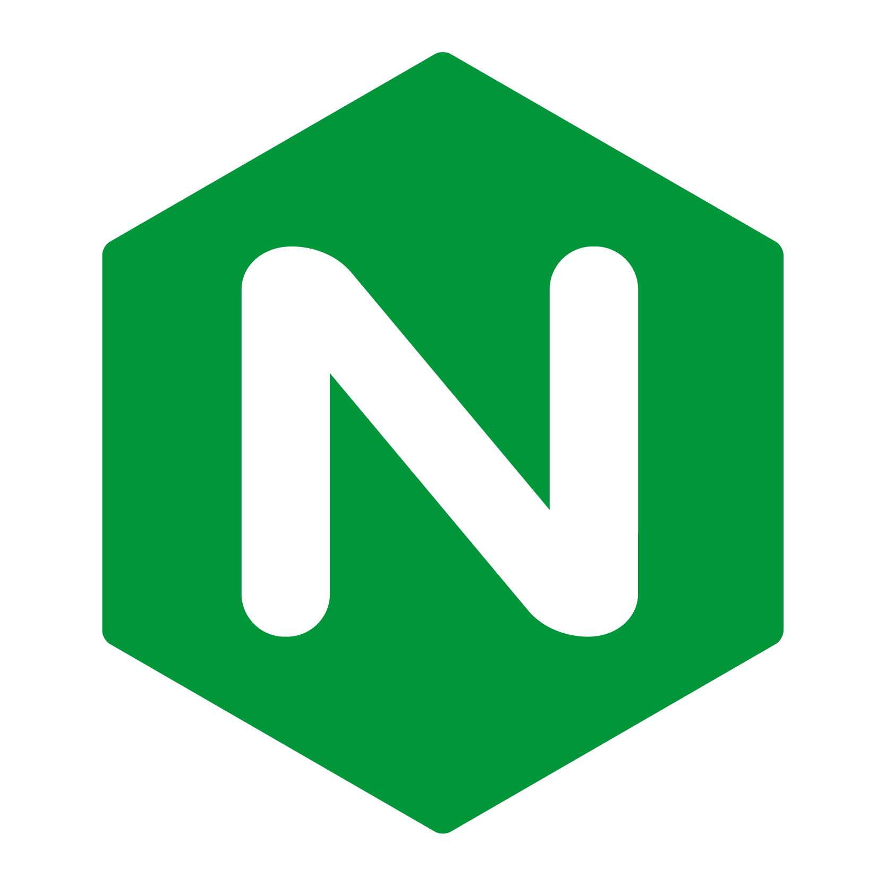
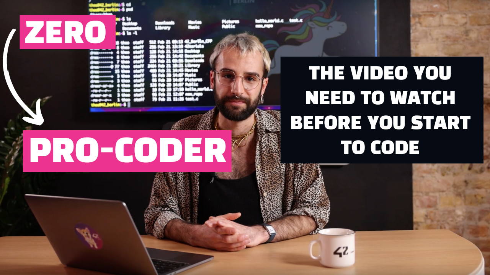
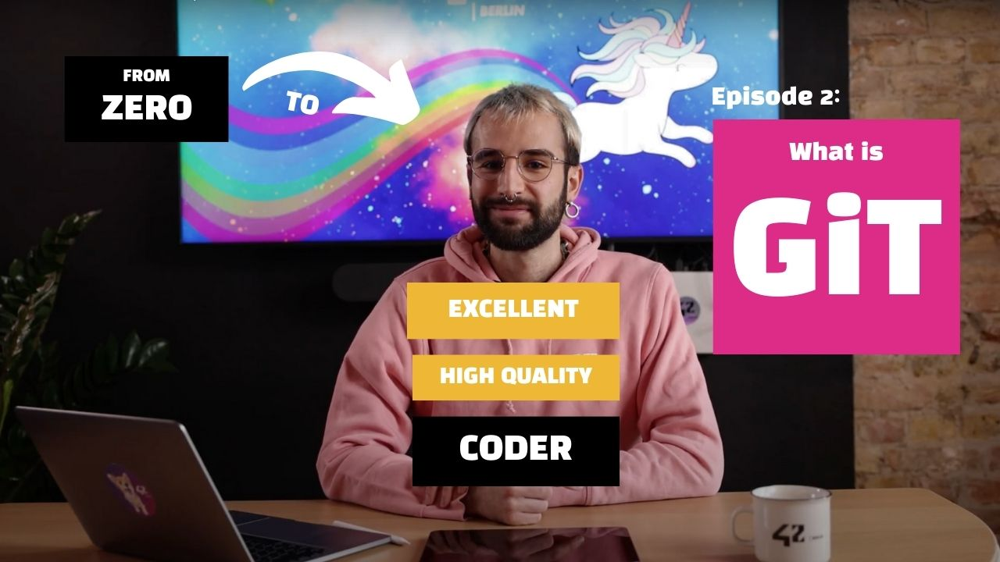
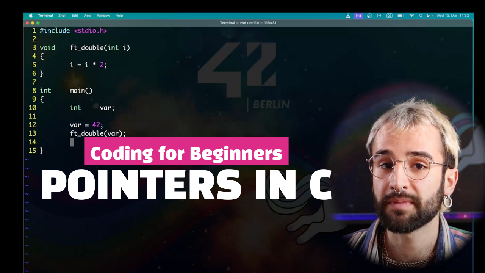
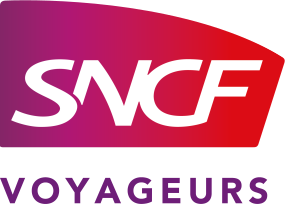

<!-- Heading -->
<h1 align="center"> Hi there! I'm Théo</h1>

  
  
  
  

<h4 align="center">Passionate about the rail industry, I am looking for a new position in Berlin starting Q3 2024</h4>

<!--Skills-->
<h1 align="center"> My skills</h1>

  
  
  
  
  
  
  
  
  

<!--42torials-->
<h1 align="center"> My coding tutorials</h1>

    
	
	

<!--Projects-->
<h1 align="center"> Some of my projects</h1>
<table align="center">
  <tr>
    <td></td>
    <td><h4>Recreating bash in C,  without any external library</h4><a href="https://github.com/theozanchi/42_Berlin_minishell">Link to repo</a></td>
    <td></td>
    <td><h4>Implementing a raytracer in C,  without any external library</h4><a href="https://github.com/theozanchi/42_Berlin_minirt">Link to repo</a></td>
  </tr>
  <tr>
    <td></td>
    <td><h4>Recreating nginx in C++, able to host a static website</h4><a href="https://github.com/theozanchi/42_Berlin_webserv">Link to repo</a></td>
    <td></td>
    <td><h4>TBC Creating a containerized pong application,  with chat and tournament features</h4><a href="https://github.com/theozanchi/42_Berlin_ft_transcendence">Link to repo</a></td>
  </tr>
</table>

<!--GitHub stats-->
<h1 align="center"> GitHub stats</h1>

  
  

<!--Professional experience-->
<h1 align="center"> My professional experience</h1>

  <table align="center">
    <tr>
      <!-- Text for first logo -->
      <td align="center" style="width: 50%;">
        <strong>Strategic project manager for the IT subsidiary of SNCF Voyageurs</strong>
      </td>
      <!-- Text for second logo -->
      <td align="center" style="width: 50%;">
        <strong>Senior IT consultant specialized in data management</strong>
      </td>
    </tr>
    <tr>
      <!-- First logo -->
      <td align="center" style="width: 50%;">
        
      </td>
      <!-- Second logo -->
      <td align="center" style="width: 50%;">
        
      </td>
    </tr>
  </table>

